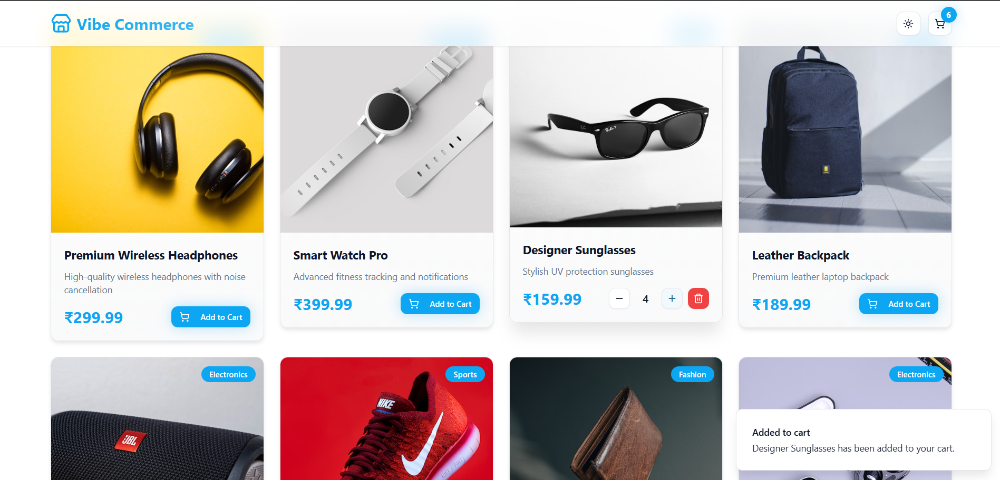

# 🛍️ Vibe Commerce

> A modern full-stack e-commerce web application built with **React + TypeScript + Node + MongoDB**, featuring a sleek UI, state persistence with **Zustand**, and dummy payments using **Razorpay**.

---
### 🌙 Dark Theme


### 💡 Light Theme



## 🚀 Tech Stack

### **Frontend**

* ⚛️ **React (Vite)** – Fast, modular frontend
* 🎨 **Tailwind CSS** – Utility-first styling
* 🧩 **shadcn/UI** – Accessible, pre-styled UI components
* 💡 **TypeScript** – Strict, scalable typing
* 🪣 **Zustand** – Lightweight global state management
* 💳 **Razorpay Integration** – Dummy payment gateway
* 📱 **Responsive Design** – Optimized for mobile & desktop

### **Backend**

* 🟢 **Node.js** + **Express** – RESTful API framework
* 🍃 **MongoDB** – NoSQL database for product & cart storage
* 🔗 **Mongoose** – Schema modeling and validation

---

## 🧠 Core Features

### 🖥️ Frontend (UI / UX)

* **Product Grid:**
  Displays all products with image, category, price, and “Add to Cart” button.
* **Cart View:**

  * Displays selected items with quantity controls
  * Real-time total calculation
  * Add / Update / Remove functionality
* **Checkout Modal:**

  * Collects user info (name + email)
  * Triggers Razorpay dummy payment
  * Shows success receipt modal after payment
* **Receipt Modal:**
  Displays purchased items, total amount, and user details.
* **Animations & Transitions:**
  Powered by Framer Motion for smooth UI flows.
* **Fully Responsive:**
  Seamless experience across mobile and desktop.

---

### ⚙️ Backend (API Endpoints)

#### 🛒 **Cart Routes**

```ts
// Fetch all cart items
router.get("/", async (req, res) => {
  const result = await cartController.getCart();
  res.status(result.status).json(result);
});

// Add product to cart
router.post("/", async (req, res) => {
  const { productId, qty } = req.body;
  const result = await cartController.addToCart(productId, qty);
  res.status(result.status).json(result);
});

// Remove product from cart
router.delete("/:id", async (req, res) => {
  const result = await cartController.removeFromCart(req.params.id);
  res.status(result.status).json(result);
});
```

#### 📦 **Product Routes**

```ts
// Get all products
router.get("/", async (req, res) => {
  const data = await productController.getProducts();
  res.status(data.status).send(data);
});

// Get product by ID
router.get("/:id", async (req, res) => {
  const { id } = req.params;
  const data = await productController.getProductById(id);
  res.status(data.status).send(data);
});
```

#### 💳 **Checkout Route**

```ts
router.get("/", async (req, res) => {
  const { name, email } = req.query;
  const data = await checkoutController.checkout(name as string, email as string);
  res.status(data.status).send(data);
});
```

---

## 🧱 Architecture Overview

**Frontend → Backend → Database Flow:**

1. Frontend fetches products from the API.
2. Users add items to cart (Zustand stores state).
3. Cart changes are synced via REST API to MongoDB.
4. Checkout Modal opens → Razorpay dummy payment → Success Receipt.
5. Orders reset after receipt confirmation.

---

## 🧾 Payment Integration

* Integrated **Razorpay Checkout SDK** for testing dummy transactions.
* Uses Razorpay test key.
* Prefilled test data (name, email, contact).
* On successful payment → Receipt Modal appears.

---

## 🧪 Setup & Run

### 1️⃣ Clone Frontend

```bash
git clone https://github.com/SamuelMasih777/vibe-ecom-frontend
cd vibe-ecom-frontend
```

### 3️⃣ Frontend Setup

```bash
npm install
npm run dev
```

Access → [http://localhost:5173](http://localhost:5173)

---

## 🎯 Future Improvements

* Add JWT-based user auth & login cart sync & pagination & search functionality & many other improvements
* Order history & invoice generation
* Cloudinary for product images
* Admin dashboard for CRUD operations
* Deployed version with CI/CD pipeline

---

## 👨‍💻 Author

**Samuel Masih**
Full-Stack Developer | React ⚛️ • Node 🟢 • TypeScript 🧩
Building clean, scalable apps with precision & great UX.